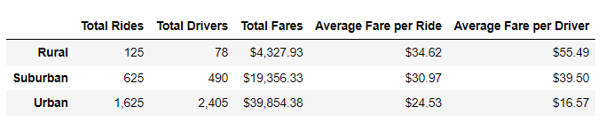
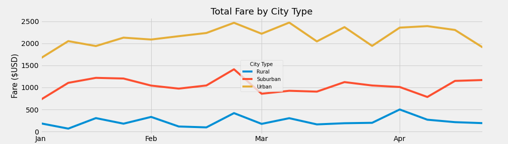

# PyBer_Analysis

## 1. Overview of the analysis: Explain the purpose of the new analysis.
The data from a ride-sharing company has been analysed to determine what how ride-sharing companies perform depending on the type of city they are operating in. The different city types included: urban, suburban and rural cities.

## 2. Results: Using images from the summary DataFrame and multiple-line chart, describe the differences in ride-sharing data among the different city types.

Data from three different city types has been analysed to determine how ride-sharing companies perform depending on whether a city is urban, suburban or rural. The following attributes have been looked at to determine the differences: total rides, total drivers, total fares, average fare per ride and driver, and total fare by city type. 

### Urban, Suburban and Rural Cities by Comparison
The following table summarizes the data from urban, suburban and rural cities:

The total rides were 13 times and 5 times more common in urban and suburban cities, respectfully, than in rural cities. Urban cities had a total of 1625 rides, suburban a total of 625 rides, and rural areas a total of 125 rides.  

There were significantly less drivers in rural areas than in urban and suburban areas, with urban cities having over 30 times (total of 2405 drivers), and suburban cities having 6 times (total of 490 drivers) as many drivers than in rural areas (total of 78 drivers). 

Urban cities collectively had a larger revenue in total fares than suburban and rural areas. The total sum in fares per city type was: $39,854.38 in urban cities, $19,356.33 in suburban cities, and $4,327.93 in rural areas. 

The average fare price per ride was higher in rural areas by over $10.09 than in urban cities, and $3.65 more expensive than in suburban cities. The average fare per ride was $24.53 in urban cities, $30.97 in suburban cities, and $34.62 in rural areas. 

Drivers were paid higher per average fare in rural areas than in urban and suburban cities. Rural drivers received $55.49 per average fare, $39.50 per average fare in suburban cities, and $16.57 per average fare in urban cities.

### Data from January 2019 to April 2019

The cities were furthermore also analysed based on the time of year. The graph below shows a snapshot of the data from January 2019 to the end of April of 2019. 

The above graph shows how the three different city types performed based on the time of year. Fare prices in rural areas averaged below $500 USD, with April having the highest fare amount. Urban and suburban cities both started the year off with gradual growth and had their highest fares in late February, reaching $2500 and close to $1500 respectfully. Urban cities then continued to have dips and growths, and had dropped at the end of April to roughly their starting point at about $1600 as in January. Suburban cities after their growth, dropped again and plateaued for the most part, with fares remaining at roughly $1250 throughout April. 

## 3. Summary: Based on the results, provide three business recommendations to the CEO for addressing any disparities among the city types.

### Rural Areas
As shown in the above graph *Total Fares by City Type*, there exists a small demand for rides in rural aras. This is due to the fact that rural areas are spread out and because there is limitation of availibility due to the small amount of drivers in the area. With natural supply and demand, the fare rates per ride and driver tend to therefore be higher, making it again less desirable for customers to utilize ride-sharing in rural areas. 

### Suburban Cities
Suburban cities, though they may not be performing as well as urban cities, still contribute close to 30% ($19,356.33) to the total revenue for all cities types combined ($63,538.64). The suburban cities charge higher for average fare per driver and ride, making it more desirable for drivers to onboard the ride-sharing company.

### Urban Cities
Urban cities, though they provide lower average fares per driver and ride, have the highest amount of total rides and total drivers, and total revenue ($39,854.38). The supply of drivers however, far outweighs the demand of customers in urban cities, creating more drivers than total rides, and thus lowering the average fare per ride and driver significantly. 

### Summary of Findings and Recommended Point of Focus
Given the analysis for the ride-sharing data, I would recommend for the company to focus on expanding their services in the suburban cities, seeing as here, there were more total rides than total drivers. This indicates that each driver had more than one ride scheduled. The demand for ride-sharing is healthier here than in urban cities. Urban cities generated more total revenue than suburban areas between January to April, however they already have more drivers than total rides available. The urban market will continue to generate revenue at the same rate, as the graph showed. The suburban area in comparison has the most room to be established. This is proven by the average fare per ride in the graph, growing at the end of April. The rural area should not be a point of focus, seeing as this market offers the least amount of revenue and does not have a lot of demand from customers in comparison to the other city types. 

